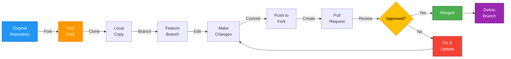
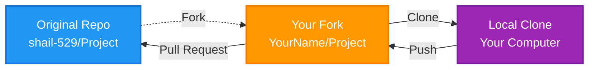

# 🚀 Contributor Guide: Open Source Contribution Workflow

Welcome to the world of Open Source! This guide will walk you through the complete process of contributing to open source projects, from forking a repository to getting your code merged.

## 📋 Table of Contents

- [Introduction](#introduction)
- [Prerequisites](#prerequisites)
- [Understanding the Workflow](#understanding-the-workflow)
- [Step-by-Step Contribution Process](#step-by-step-contribution-process)
- [Best Practices](#best-practices)
- [Troubleshooting](#troubleshooting)
- [Quick Reference](#quick-reference)

---

## Introduction

### What is Open Source?

Open Source projects are software projects where the code is publicly available for anyone to view, use, modify, and contribute to. Contributing to open source is a great way to:

- Learn from real-world code
- Build your portfolio
- Collaborate with developers worldwide
- Give back to the community

### What is a Pull Request (PR)?

A **Pull Request** is your way of saying to the repository owner:

> "I have made some changes on my copy (fork). Please **PULL** these changes into your original repository."

It's called a "Request" because the maintainer has the right to:
- ✅ **Approve** and merge your changes
- ❌ **Reject** and close your PR
- 🔍 **Request changes** and ask you to improve your code

---

## Prerequisites

Before you start contributing, make sure you have:

- ✅ **Git installed** on your computer ([Download Git](https://git-scm.com/downloads))
- ✅ **GitHub account** ([Sign up](https://github.com/signup))
- ✅ **Basic Git knowledge** (clone, commit, push)
- ✅ **Text editor or IDE** (VS Code, Sublime, etc.)

---

## Understanding the Workflow

Here's a visual representation of the Open Source contribution workflow:



### Repository Relationships



---

## Step-by-Step Contribution Process

### Step 1: Fork the Repository

**What is Forking?**
Forking creates a personal copy of someone else's repository in your GitHub account.

1. Go to the original repository (e.g., `shail-529/Open-Source`)
2. Click the **Fork** button in the top-right corner
3. Select your account as the destination
4. GitHub creates a copy: `YourUsername/Open-Source`

> [!NOTE]
> Your fork is completely independent. Changes you make won't affect the original repository until you create a Pull Request.

---

### Step 2: Clone Your Fork

Now download your fork to your local computer:

```bash
# Clone your fork (replace YourUsername with your GitHub username)
git clone https://github.com/YourUsername/Open-Source.git

# Navigate into the project folder
cd Open-Source
```

**What just happened?**
- You now have a local copy of the project on your computer
- Git automatically sets up `origin` to point to your fork

---

### Step 3: Sync Your Fork (Important!)

Before starting new work, always sync your fork with the original repository to get the latest changes.

#### Option A: Using GitHub Website (Easy)

1. Go to your fork on GitHub
2. Look for the **"Sync fork"** button
3. Click **"Update branch"** if changes are available

#### Option B: Using Terminal (Advanced)

```bash
# Add the original repository as 'upstream'
git remote add upstream https://github.com/shail-529/Open-Source.git

# Fetch latest changes from original repo
git fetch upstream

# Switch to your main branch
git checkout main

# Merge upstream changes into your main
git merge upstream/main

# Push updates to your fork
git push origin main
```

> [!IMPORTANT]
> **Always sync before creating a new feature branch!** This ensures you're working with the latest code.

---

### Step 4: Create a Feature Branch

> [!WARNING]
> **NEVER COMMIT DIRECTLY TO THE MAIN BRANCH!** This is one of the most important rules in open source.

**Why use feature branches?**
- Keeps your `main` branch clean and synced with the original
- Allows you to work on multiple features simultaneously
- Makes it easy to create separate PRs for different features

```bash
# Make sure you're on main branch
git checkout main

# Pull latest changes (if you didn't sync via website)
git pull origin main

# Create and switch to a new feature branch
git checkout -b fix-readme-typo
```

**Branch Naming Tips:**
- Use descriptive names: `add-dark-mode`, `fix-login-bug`, `update-docs`
- Use hyphens, not spaces: `feature-name` not `feature name`
- Keep it short but meaningful

---

### Step 5: Make Your Changes

Now it's time to actually edit the code!

1. Open the project in your text editor
2. Make your changes (fix bugs, add features, update docs)
3. Test your changes to ensure they work

**Example:** Let's say you're fixing a typo in README.md:

```bash
# Open README.md in your editor and make changes
# Save the file
```

---

### Step 6: Commit Your Changes

After making changes, you need to "save" them with Git:

```bash
# Check what files you changed
git status

# Stage all changed files
git add .

# Or stage specific files
git add README.md

# Commit with a clear message
git commit -m "Fix typo in installation instructions"
```

**Good Commit Messages:**
- ✅ `Fix typo in README installation section`
- ✅ `Add dark mode toggle to navbar`
- ✅ `Fix login redirect bug for new users`

**Bad Commit Messages:**
- ❌ `fix stuff`
- ❌ `update`
- ❌ `changes`

---

### Step 7: Push to Your Fork

Send your commits from your local computer to your GitHub fork:

```bash
# Push your feature branch to your fork
git push -u origin fix-readme-typo
```

**What the `-u` flag does:**
- Sets up tracking between your local branch and remote branch
- Next time you can just use `git push` without specifying the branch

**Terminal Output:**
After pushing, Git will show you a link to create a Pull Request:

```
remote: Create a pull request for 'fix-readme-typo' on GitHub by visiting:
remote:      https://github.com/YourUsername/Open-Source/pull/new/fix-readme-typo
```

You can **Ctrl+Click** this link to open it directly!

---

### Step 8: Create a Pull Request

This is where you formally request the maintainer to merge your changes.

#### Using the GitHub Website:

1. Go to your fork on GitHub (`YourUsername/Open-Source`)
2. You'll see a yellow banner: **"Compare & pull request"** — Click it
3. If you don't see the banner:
   - Click the **"Pull requests"** tab
   - Click **"New pull request"**
   - Click **"compare across forks"**

#### Configure the PR Correctly:

> [!CRITICAL]
> Make sure the arrows point in the right direction!

```
base repository: shail-529/Open-Source (branch: main)  
   ⬅ head repository: YourUsername/Open-Source (branch: fix-readme-typo)
```

**Translation:** You're asking to move code FROM your feature branch TO the original main branch.

#### Write a Good PR Description:

**Title:** `Fix typo in installation instructions`

**Description:**
```markdown
## What does this PR do?
Fixes a typo in the README.md file where "instalation" was misspelled.

## Changes made
- Fixed typo: "instalation" → "installation"

## Testing
- Verified the README renders correctly on GitHub
```

4. Click **"Create pull request"**

---

### Step 9: Respond to Reviews

The maintainer will review your code. They might:

#### ✅ Approve and Merge
Great! Your contribution is now part of the project!

#### 🔍 Request Changes
The maintainer might comment asking you to:
- Fix a bug in your code
- Follow their coding style
- Add tests or documentation

**How to make changes:**

```bash
# Make the requested changes in your editor
# Then commit and push again

git add .
git commit -m "Address review feedback: add error handling"
git push origin fix-readme-typo
```

> [!NOTE]
> When you push to the same branch, the PR automatically updates! You don't need to create a new PR.

---

### Step 10: Post-Merge Cleanup (IMPORTANT!)

Congratulations! Your PR was merged! 🎉 But you're not done yet. Follow these cleanup steps:

#### A. Delete the Remote Branch on GitHub

1. Go to the merged Pull Request page
2. GitHub shows a button: **"Delete branch"**
3. Click it to remove the feature branch from your fork

#### B. Delete the Local Branch

```bash
# Switch back to main branch
git checkout main

# Delete the feature branch locally
git branch -d fix-readme-typo
```

> [!NOTE]
> Git will warn you if the branch wasn't fully merged (safety feature).

#### C. Sync Your Fork Again

Now that the original repository has your changes, update your fork:

```bash
# Pull the latest changes (which now include YOUR contribution!)
git pull origin main

# Or sync via GitHub website using "Sync fork" button
```

**Why Clean Up?**
- Keeps your repository organized
- Prevents confusion about which branches are active
- Saves disk space
- Follows professional best practices

---

## Best Practices

### The Golden Rules

1. **Never commit to main branch**
   - Always create feature branches
   - Keep `main` as a clean mirror of the original repo

2. **Sync before starting new work**
   - Click "Sync fork" on GitHub, OR
   - Run `git pull upstream main` locally

3. **One feature = One branch = One PR**
   - Don't mix multiple features in one PR
   - Makes review easier for maintainers

4. **Write clear commit messages**
   - Explain WHAT and WHY, not just "changes"
   - Use present tense: "Fix bug" not "Fixed bug"

5. **Test before pushing**
   - Make sure your code actually works
   - Don't break existing functionality

6. **Clean up after merge**
   - Delete feature branches both locally and remotely
   - Keep your workspace tidy

### Communication Tips

- Be polite and professional
- Respond to review comments promptly
- Don't take feedback personally — it's about the code, not you
- Ask questions if you don't understand feedback
- Thank maintainers for their time

---

## Troubleshooting

### Issue: "Sync fork" button is greyed out

**Solution:** Your fork is already up-to-date! No action needed.

---

### Issue: Merge Conflicts

**What happened:** Someone else changed the same lines of code you changed.

**Solution:**
```bash
# Pull latest changes from upstream
git fetch upstream
git merge upstream/main

# Git will mark conflicts in your files
# Open the files and resolve conflicts manually
# Look for markers like <<<<<<< HEAD

# After fixing conflicts
git add .
git commit -m "Resolve merge conflicts"
git push origin your-branch-name
```

---

### Issue: Not receiving email notifications

**Solution:**

1. Click your profile → **Settings** → **Notifications**
2. Under "Participating", check the **Email** box
3. Verify your email address is correct
4. Check your spam folder

**Alternative:** Check the 🔔 Bell icon at the top of GitHub for web notifications.

---

### Issue: Pushed to wrong branch

**If you accidentally pushed to main:**

```bash
# First, create a new branch from current commit
git branch feature-branch-name

# Reset main to match upstream
git checkout main
git reset --hard upstream/main
git push origin main --force

# Switch to your feature branch
git checkout feature-branch-name
git push -u origin feature-branch-name
```

> [!WARNING]
> Use `--force` carefully! It rewrites history.

---

### Issue: Want to cancel/close my PR

**Solution:**

1. Go to your Pull Request on GitHub
2. Scroll to the bottom
3. Click **"Close pull request"**

> [!NOTE]
> Closing a PR doesn't delete it — maintainers can still see it. Only close if you're truly abandoning the work.

---

## Quick Reference

### Complete Workflow Checklist

```markdown
☐ Fork the repository
☐ Clone your fork
☐ Sync your fork (get latest changes)
☐ Create feature branch
☐ Make changes
☐ Test changes
☐ Commit with clear message
☐ Push to your fork
☐ Create Pull Request
☐ Respond to reviews
☐ Wait for merge
☐ Delete remote branch (on GitHub)
☐ Delete local branch
☐ Sync fork again
```

### Essential Commands

```bash
# Initial setup
git clone https://github.com/YourUsername/repo.git
cd repo
git remote add upstream https://github.com/Original/repo.git

# Start new feature
git checkout main
git pull origin main
git checkout -b feature-name

# Make changes
git add .
git commit -m "Description of changes"
git push -u origin feature-name

# After PR is merged
git checkout main
git pull origin main
git branch -d feature-name
```

---

## Next Steps

Now that you understand the workflow:

1. Find a project you're interested in
2. Look for issues labeled **"good first issue"** or **"beginner-friendly"**
3. Follow this guide step by step
4. Make your first contribution!

**Recommended Resources:**
- [GitHub's Hello World Guide](https://guides.github.com/activities/hello-world/)
- [First Timers Only](https://www.firsttimersonly.com/)
- [Up For Grabs](https://up-for-grabs.net/)

---

**Happy Contributing! 🎉**

Remember: Every expert was once a beginner. Don't be afraid to ask questions and learn from mistakes. The open source community is here to help you grow!
