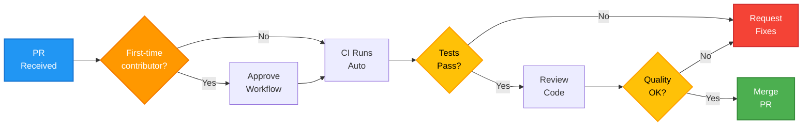
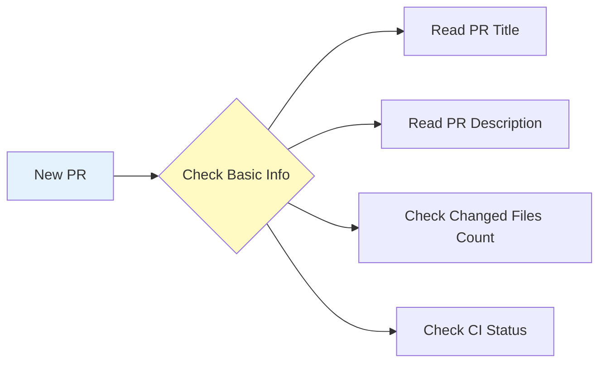
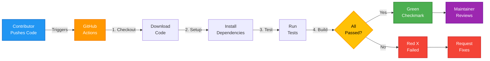

# 🛡️ Maintainer Guide: Managing Open Source Contributions

Welcome to the maintainer's side of Open Source! This guide will help you manage contributions, review Pull Requests, set up automated checks, and maintain a healthy open source project.

## 📋 Table of Contents

- [Introduction](#introduction)
- [Prerequisites](#prerequisites)
- [Understanding Your Role](#understanding-your-role)
- [The Maintainer Workflow](#the-maintainer-workflow)
- [Setting Up GitHub Actions](#setting-up-github-actions)
- [Best Practices](#best-practices)
- [Troubleshooting](#troubleshooting)
- [Quick Reference](#quick-reference)

---

## Introduction

### What is a Maintainer?

As a **maintainer**, you are the guardian of your open source project. You:

- Review code submissions (Pull Requests)
- Ensure code quality and consistency
- Protect the project from breaking changes
- Guide and mentor contributors
- Make final decisions on what gets merged

### Your Responsibilities

✅ **Quality Assurance** - Ensure contributions don't break existing functionality  
✅ **Code Review** - Provide constructive feedback on submissions  
✅ **Communication** - Respond to contributors in a timely, professional manner  
✅ **Automation** - Set up CI/CD to catch issues early  
✅ **Documentation** - Keep contribution guidelines clear and up-to-date

---

## Prerequisites

Before managing contributions, you should have:

- ✅ **Repository ownership** or maintainer access
- ✅ **Strong Git knowledge** (branching, merging, conflicts)
- ✅ **Understanding of your codebase** and its architecture
- ✅ **Code review skills** - ability to spot bugs and anti-patterns
- ✅ **GitHub account** with appropriate permissions

---

## Understanding Your Role

### The Maintainer's Perspective



---

## The Maintainer Workflow

### Step 1: Receiving Pull Requests

When a contributor creates a Pull Request (PR), you'll be notified:

**Notification Channels:**
- 🔔 GitHub bell icon (in-app notification)
- 📧 Email notification (if enabled)
- 📱 Mobile app notification (if installed)

**Where to find PRs:**
1. Go to your repository on GitHub
2. Click the **"Pull requests"** tab
3. You'll see a number badge if there are open PRs

---

### Step 2: Initial PR Assessment

Before diving into the code, do a quick assessment:



**Questions to ask:**
- ✅ Is the PR title descriptive?
- ✅ Does the description explain WHAT and WHY?
- ✅ Are there too many files changed? (might be too broad)
- ✅ Is there a related issue linked?

---

### Step 3: Approve Workflow for First-Time Contributors

> [!IMPORTANT]
> GitHub has a security feature that prevents workflows from running automatically for first-time contributors.

**The yellow warning you'll see:**

```
⚠️ 1 workflow awaiting approval
This workflow run is waiting for approval to use actions.
```

**Why this exists:**
To prevent malicious actors from running harmful code on your servers.

**How to approve:**

1. Click on the **"Actions"** tab
2. Find the workflow waiting for approval
3. Click **"Approve and run"**
4. The workflow will now execute

> [!NOTE]
> After the first approved PR, this contributor won't need approval again for future PRs.

---

### Step 4: Review Automated Checks

If you've set up GitHub Actions (covered later), wait for the automated checks to complete.

**Check Results:**

| Status | Icon | Meaning | Action |
|--------|------|---------|--------|
| Success | ✅ Green checkmark | All tests passed | Proceed to code review |
| Failure | ❌ Red X | Tests failed | Request contributor to fix |
| Pending | 🟡 Yellow dot | Tests running | Wait for completion |

**If tests fail:**

1. Click on the red X to see details
2. Find what failed (build error, lint issue, test failure)
3. Comment on the PR with specific feedback:

```markdown
Hey @contributor, thanks for the PR! 

The CI checks are failing because:
- `npm test` is failing on line 42 of `utils.js`
- Lint error: missing semicolon in `app.js:15`

Could you please fix these issues and push again? Thanks!
```

---

### Step 5: Code Review (The Visual Diff)

This is where you actually read the code changes.

**How to review:**

1. Go to the Pull Request
2. Click the **"Files changed"** tab
3. You'll see a diff view:
   - 🔴 **Red lines** = Code removed
   - 🟢 **Green lines** = Code added
   - ⚪ **Grey lines** = Context (unchanged)

**What to look for:**

✅ **Correctness**
- Does the code do what it claims to do?
- Are there logical errors?

✅ **Code Quality**
- Is the code readable and maintainable?
- Does it follow your project's style guide?
- Are variable names descriptive?

✅ **Safety**
- No hardcoded credentials or API keys
- No console.log statements left in production code
- Proper error handling

✅ **Testing**
- Are there tests for new features?
- Do existing tests still pass?

✅ **Breaking Changes**
- Does this change break existing functionality?
- Will users need to update their code?

**How to leave comments:**

1. Hover over a line of code in the diff
2. Click the **+** blue button that appears
3. Type your comment
4. Click **"Start a review"** or **"Add review comment"**

**Example Comments:**

```markdown
💡 Suggestion: Consider using `const` instead of `let` here since the value doesn't change.
```

```markdown
❓ Question: What happens if `user` is undefined here?
```

```markdown
⚠️ Issue: This could cause a memory leak. We should clean up event listeners.
```

---

### Step 6: Testing Changes Locally (Optional)

For complex changes, you may want to run the code on your own computer.

**Method 1: Fetch the PR branch**

```bash
# Fetch the PR (replace 123 with the PR number)
git fetch origin pull/123/head:pr-123

# Switch to that branch
git checkout pr-123

# Run the project
npm start  # or your project's start command

# Test the changes manually
```

**Method 2: Check out contributor's fork**

```bash
# Add contributor's fork as a remote
git remote add contributor https://github.com/contributor/repo.git

# Fetch their branch
git fetch contributor feature-branch

# Check it out
git checkout contributor/feature-branch
```

**What to test:**
- Does the app run without errors?
- Does the new feature work as described?
- Are there any unexpected side effects?

---

### Step 7: Request Changes or Approve

After reviewing, you have three options:

#### Option A: Approve ✅

If everything looks good:

1. Click **"Review changes"** button
2. Select **"Approve"**
3. Add a comment like: `"Looks great! Thanks for the contribution."`
4. Click **"Submit review"**

#### Option B: Request Changes 🔄

If issues need to be fixed:

1. Click **"Review changes"** button
2. Select **"Request changes"**
3. Summarize what needs to be fixed
4. Click **"Submit review"**

**Example request:**

```markdown
Thanks for the PR! Before we can merge, please address:

1. Remove the `console.log` on line 42
2. Add a null check for the `user` parameter
3. Update the tests to cover the new edge case

Let me know if you need any help!
```

#### Option C: Comment Only 💬

For minor suggestions that don't block merging:

1. Click **"Review changes"** button
2. Select **"Comment"**
3. Add your feedback
4. Click **"Submit review"**

---

### Step 8: Merge the Pull Request

Once everything is approved and tests pass, it's time to merge!

**Merging Options:**

GitHub offers three merge strategies:

| Strategy | Description | When to Use |
|----------|-------------|-------------|
| **Merge commit** | Creates a merge commit preserving all commits | Default, good for most cases |
| **Squash and merge** | Combines all commits into one | When PR has many "fix typo" commits |
| **Rebase and merge** | Replays commits onto base branch | For linear history (advanced) |

**How to merge:**

1. Scroll to the bottom of the PR conversation
2. Click the green **"Merge pull request"** button
3. Choose your merge strategy (or use default)
4. Click **"Confirm merge"**
5. Optionally: Click **"Delete branch"** to clean up

**After merging:**

- The PR status changes to **"Merged"** (purple badge)
- The contributor gets a notification
- The code is now in your main branch
- The feature branch can be deleted

---

## Setting Up GitHub Actions

Automation is your best friend! GitHub Actions can automatically test every PR before you even look at it.

### Why Use GitHub Actions?

✅ **Save Time** - Don't manually test every submission  
✅ **Catch Errors Early** - Find bugs before code review  
✅ **Enforce Standards** - Automatically check code style  
✅ **Set Quality Gates** - Only merge code that passes tests

### GitHub Actions Architecture

**GitHub Actions Flow**:



### Step-by-Step: Creating Your First Workflow

#### 1. Create the Workflow File

GitHub Actions workflows live in a specific folder: `.github/workflows/`

**On GitHub Website:**

1. Go to your repository
2. Click **"Add file"** → **"Create new file"**
3. In the filename box, type: `.github/workflows/safety-check.yml`
   - Type `.github` then press `/` (creates folder)
   - Type `workflows` then press `/` (creates subfolder)
   - Type `safety-check.yml`

#### 2. Write the Workflow Configuration

Copy and paste this basic workflow:

```yaml
name: Safety Check

# When should this workflow run?
on:
  pull_request:
    branches: [ "main" ]  # Run on PRs targeting main
  push:
    branches: [ "main" ]  # Run when code is pushed to main

# What should the workflow do?
jobs:
  build-and-test:
    runs-on: ubuntu-latest  # Use GitHub's Linux server

    steps:
      # Step 1: Download the code
      - name: Checkout code
        uses: actions/checkout@v3

      # Step 2: Run a basic safety check
      - name: Run a Test Script
        run: |
          echo "Starting safety checks..."
          
          # Check if README exists
          if [ -f "README.md" ]; then
            echo "✅ SUCCESS: README.md found!"
          else
            echo "❌ ERROR: README.md is missing!"
            exit 1  # This tells GitHub the test failed
          fi
          
          echo "All checks passed! 🎉"
```

#### 3. Understanding the YAML Structure

```yaml
name: Safety Check           # Workflow name (shows in Actions tab)

on:                          # Trigger conditions
  pull_request:              # Run on pull requests
    branches: [ "main" ]     # Only for PRs targeting main

jobs:                        # Define what to do
  build-and-test:            # Job name
    runs-on: ubuntu-latest   # Operating system
    
    steps:                   # Individual tasks
      - name: Step Name      # Human-readable step name
        uses: action@v3      # Use a pre-built action
        # OR
        run: |               # Run shell commands
          echo "Hello"
```

#### 4. Commit the Workflow

1. Scroll down to "Commit changes"
2. Commit message: `Add CI workflow for safety checks`
3. Select **"Commit directly to the main branch"**
4. Click **"Commit changes"**

**What happens next:**

- The workflow file is now in your repository
- It will run automatically on the next PR
- You can see it in the **"Actions"** tab

---

### Customizing Your Workflow

#### For a Node.js Project:

```yaml
name: Node.js CI

on:
  pull_request:
    branches: [ "main" ]

jobs:
  test:
    runs-on: ubuntu-latest
    
    steps:
      - uses: actions/checkout@v3
      
      - name: Setup Node.js
        uses: actions/setup-node@v3
        with:
          node-version: '18'
      
      - name: Install dependencies
        run: npm ci
      
      - name: Run tests
        run: npm test
      
      - name: Run linter
        run: npm run lint
```

#### For a Python Project:

```yaml
name: Python CI

on:
  pull_request:
    branches: [ "main" ]

jobs:
  test:
    runs-on: ubuntu-latest
    
    steps:
      - uses: actions/checkout@v3
      
      - name: Setup Python
        uses: actions/setup-python@v4
        with:
          python-version: '3.10'
      
      - name: Install dependencies
        run: |
          python -m pip install --upgrade pip
          pip install -r requirements.txt
      
      - name: Run tests
        run: pytest
```

---

### Workflow Status on Pull Requests

Once set up, you'll see status checks at the bottom of every PR:

```
✅ All checks have passed
   ✓ build-and-test / test

   This branch has no conflicts with the base branch
   
   [Merge pull request ▼]
```

Or if it fails:

```
❌ Some checks were not successful
   ✗ build-and-test / test — The tests failed

   [View details]
```

Click **"View details"** to see exactly what failed.

---

## Best Practices

### Code Review Best Practices

#### 1. Be Kind and Constructive

❌ **Bad:** "This code is terrible."  
✅ **Good:** "This could be improved by using a more descriptive variable name. Consider renaming `d` to `userData`."

❌ **Bad:** "You don't know what you're doing."  
✅ **Good:** "I see what you're trying to do here. A better approach might be to use X because Y. Here's an example: [code snippet]"

#### 2. Explain the "Why"

Don't just say "change this." Explain why:

```markdown
Please move this logic to a separate function because:
1. It makes the code more testable
2. It can be reused in other places
3. It improves readability
```

#### 3. Use Review Templates

Create saved replies for common feedback:

**For first-time contributors:**
```markdown
Thanks for your first contribution! 🎉 I've left some comments on the code. 
Don't worry if changes are needed — that's totally normal! Let me know if 
you have any questions.
```

**For failed tests:**
```markdown
Thanks for the PR! The automated tests are failing. Please check the 
"Actions" tab to see the error details. Happy to help if you need 
guidance!
```

#### 4. Prioritize Feedback

Use labels to categorize your comments:

- 🔴 **MUST FIX** - Blocks merging (security, breaking changes)
- 🟡 **SHOULD FIX** - Important but not blocking
- 🟢 **NICE TO HAVE** - Optional improvements

#### 5. Respond Promptly

- Aim to respond within 48 hours
- If you're busy, leave a quick note: "Thanks for the PR! I'll review this by Friday."
- Set up email notifications so you don't miss contributions

---

### Repository Management Best Practices

#### 1. Protect Your Main Branch

**Settings → Branches → Branch protection rules:**

✅ **Require pull request reviews** - Force code review  
✅ **Require status checks to pass** - Must pass CI before merging  
✅ **Require branches to be up to date** - Avoid merge conflicts  
❌ **Disallow force pushes** - Protect history

#### 2. Create Contribution Guidelines

Create a `CONTRIBUTING.md` file in your repository:

```markdown
# Contributing to [Project Name]

## Getting Started
1. Fork the repository
2. Create a feature branch
3. Make your changes
4. Submit a Pull Request

## Code Style
- Use 2 spaces for indentation
- Follow ESLint rules
- Write descriptive commit messages

## Testing
- Add tests for new features
- Ensure all tests pass before submitting
```

#### 3. Use Issue Templates

Create `.github/ISSUE_TEMPLATE/bug_report.md`:

```markdown
---
name: Bug Report
about: Report a bug
---

**Describe the bug**
A clear description of what the bug is.

**Steps to reproduce**
1. Go to '...'
2. Click on '...'
3. See error

**Expected behavior**
What you expected to happen.
```

#### 4. Label Your Issues and PRs

Use labels to organize work:

- `good first issue` - For beginners
- `bug` - Something isn't working
- `enhancement` - New feature request
- `documentation` - Documentation improvements
- `help wanted` - Extra attention needed

---

### Communication Best Practices

#### 1. Welcome New Contributors

Make people feel valued:

```markdown
Welcome to [Project Name]! 🎉 Thanks for taking the time to contribute. 
This is great!
```

#### 2. Close Stale PRs Gracefully

If a PR has been inactive for months:

```markdown
Hey @contributor, this looks interesting but it's been a few months 
since the last update. Are you still interested in continuing this work? 
If not, I'll close this PR for now, but feel free to reopen it later!
```

Wait a week, then close with:

```markdown
Closing due to inactivity. Feel free to reopen when ready!
```

#### 3. Give Credit

When merging, acknowledge the contributor:

```markdown
Merged! Thanks @contributor for this improvement. This will help a lot 
of users! 🚀
```

---

## Troubleshooting

### Issue: Too many PRs to review

**Solution:**

1. Use labels to prioritize
2. Set up GitHub Actions to auto-test
3. Only review PRs that pass CI first
4. Consider adding more maintainers

---

### Issue: Contributor isn't responding to feedback

**Actions:**

1. Wait 7 days
2. Ping once: "@contributor, checking in on this. Any updates?"
3. Wait another 7 days
4. Close the PR gracefully (see communication best practices)

---

### Issue: Merge conflicts in PR

**Solution:**

Ask the contributor to update their branch:

```markdown
This PR has merge conflicts. Please sync your fork with the main branch:

git checkout main
git pull upstream main
git checkout your-feature-branch
git merge main
# Resolve conflicts
git push origin your-feature-branch
```

Or offer to help:

```markdown
I can help resolve these conflicts if needed!
```

---

### Issue: Workflow not running

**Check:**

1. Is the file in `.github/workflows/`?
2. Is it a `.yml` or `.yaml` file?
3. Is the YAML syntax correct? (use a [YAML validator](https://www.yamllint.com/))
4. Check the "Actions" tab for error messages

---

## Quick Reference

### PR Review Checklist

```markdown
☐ Read PR title and description
☐ Check if issue is linked
☐ Approve workflow (if first-time contributor)
☐ Wait for CI checks to pass
☐ Review "Files changed" tab
☐ Check for:
  ☐ Code correctness
  ☐ Code quality
  ☐ Security issues
  ☐ Breaking changes
  ☐ Test coverage
☐ Leave helpful comments
☐ Approve or request changes
☐ Merge when ready
☐ Thank the contributor!
```

### Essential Commands

```bash
# Test a PR locally
git fetch origin pull/PR_NUMBER/head:pr-branch
git checkout pr-branch

# Delete a branch after merge
git branch -d branch-name
git push origin --delete branch-name

# Update your local repository
git checkout main
git pull origin main
```

### Workflow Debugging

```bash
# Validate YAML syntax
yamllint .github/workflows/yourfile.yml

# Test workflow locally (using act)
act -l  # List workflows
act pull_request  # Simulate PR event
```

---

## Next Steps

As a maintainer, continuously improve your project:

1. **Set up automated testing** with GitHub Actions
2. **Create clear documentation** in your README
3. **Add contribution guidelines** in CONTRIBUTING.md
4. **Use issue templates** to standardize requests
5. **Build a welcoming community** through kind, constructive feedback

**Recommended Resources:**
- [GitHub Actions Documentation](https://docs.github.com/en/actions)
- [Open Source Guides](https://opensource.guide/)
- [How to Write a Good Pull Request](https://github.blog/2015-01-21-how-to-write-the-perfect-pull-request/)

---

**Good luck maintaining your project! 🚀**

Remember: Your role as a maintainer is to empower contributors, maintain code quality, and build a welcoming community. Every "yes" or "no" shapes the future of your project!
